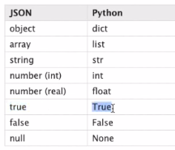

### methods in json module
- [ ] **.loads(string)** : Converts a json string to python dictionary/list.
  - [ ] Conversion table 
    
  - [ ] Eg:
  ```py
    data_string = '{"name":"Manas", "age":22}"
    data_python = json.loads(data_string)
    print(data_python, type(data_python))

    data_string = '[{"name":"Manas"}, {"name":"Mishra"}]'
    data_python = json.loads(data_string)
    print(data_python, type(data_python))
  ```
- [ ] **.dumps(data_python)** : Converts python data to json string.
  - [ ] You can pass `indent=2` to view in more readable format.
  - [ ] You can pass `sorted_keys=True` to sort json data.
  - [ ] You can pass `content_type='application/json'`
- [ ] **.load(file_object)** : Converts a json file to python object.
  - [ ] Eg: `python_object = json.load(open("test.json"))`
- [ ] **.dump(data_python, file_object)** : Saves data_python to file_object.
  - [ ] You can pass `indent` and `sorted_keys` here also.
- [ ] 